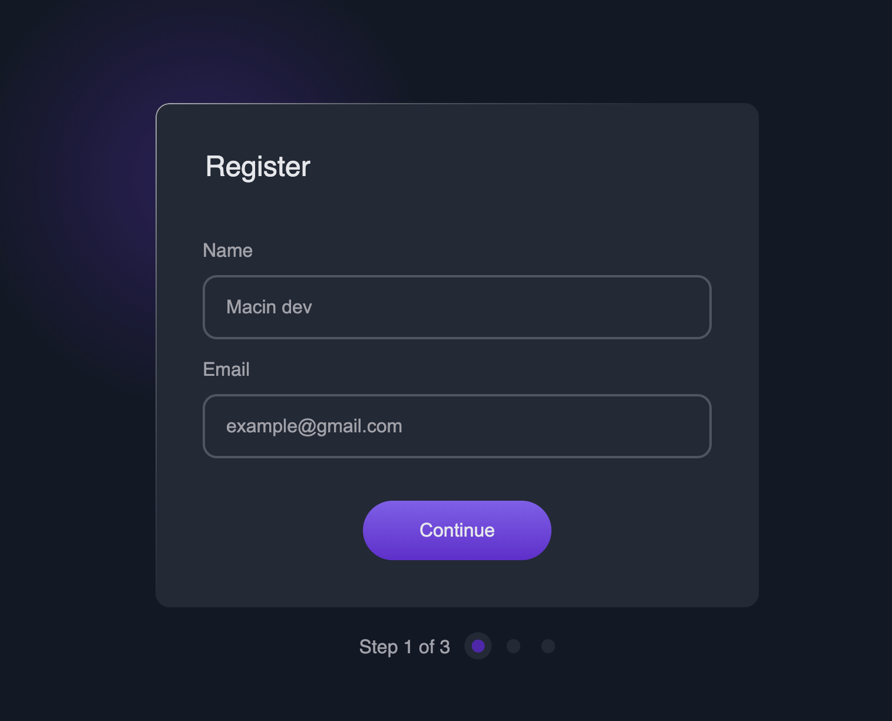

<!-- Please update value in the {}  -->

<h1 align="center">Multi-step Register Form | devChallenges</h1>

<div align="center">
  <h3>
    <a href="https://macin-multistep-form.vercel.app">
      Demo
    </a>
    <span> | </span>
    <a href="https://devchallenges.io/solution/60883">
      Solution
    </a>
    <span> | </span>
    <a href="https://devchallenges.io/challenge/multi-step-register-form">
      Challenge
    </a>
  </h3>
</div>

<!-- TABLE OF CONTENTS -->

## Table of Contents

- [Overview](#overview)
  - [What I learned](#what-i-learned)
- [Built with](#built-with)
- [Contact](#contact)
<!-- OVERVIEW -->

## Overview



<!--
Introduce your projects by taking a screenshot or a gif. Try to tell visitors a story about your project by answering:

- What have you learned/improved?
- Your wisdom? :)
-->

### What I learned

### CSS

The following code improves accessibility for users who rely on assistive technology, by default, background images defined in CSS are ignored by screen readers. Additionally, using an `` tag with an empty `alt` description causes the image to be treated as decorative, meaning it does not convey semantic information and only enhances visual appearance. I tested this behavior as well.

```css
selector::after {
  content: "";
  background: url("decorative.png");
}
```

Here is a short list of CSS stuff I learned and used:

- `:focus-within` (pseudo class)
- `inset` shortcut for `top`, `right`, `bottom`, and `left` properties

### JavaScript

During the course of this project, I’ve been noticing some programming style patterns (even though it’s a small project 😅). Adding interactivity with vanilla JavaScript can involve a lot of boilerplate because of its imperative nature: you have to tell JavaScript not only _what_ to do, but also _how_ to do it—querying elements, registering event listeners, and defining callbacks that execute when the user interacts with those elements.

That’s why the core takeaway from this project was using ES6 Modules (a feature released in 2015). They split the code into separate files, making it more maintainable, flexible, and much easier to debug. At the very least, it’s one useful approach to better understanding how to structure code.

```css
console.log('Happi coding! 🎉');
/* Yeah, I use semicolons in JS */
```

### Built with

<!-- This section should list any major frameworks that you built your project using. Here are a few examples.-->

- Semantic HTML5 markup
- CSS & custom properties
- Flexbox
- JavaScript

## Author

- X [@ErnestGadget](https://{x.com/ErnestGadget})
- GitHub [@macin-dev](https://{github.com/macin-dev})
